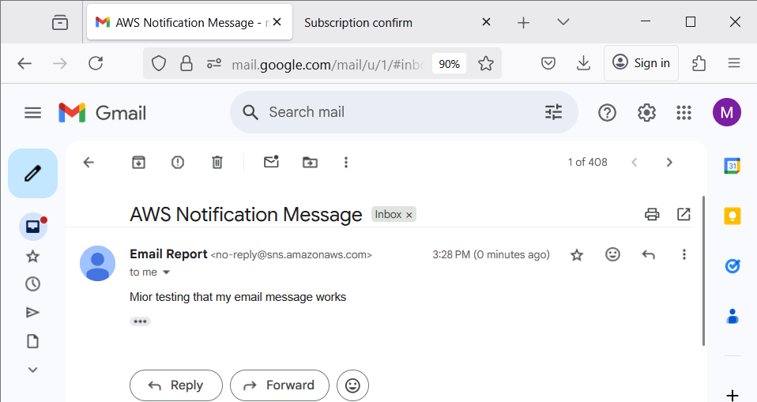

# stepbirdsigh
stepbirdsigh : Bird Sighting # Step Functions

## Objective
To orchestrate multi-step processes with AWS Step Functions.
Work with & integrate Step Functions with SNS, Lambda, IAM/Cognito, DynamoDB, Cloud9/JS/NPM & S3. 
To create Express asynchronous state machine in Step Functions.

## Bird Sighting Step Functions

